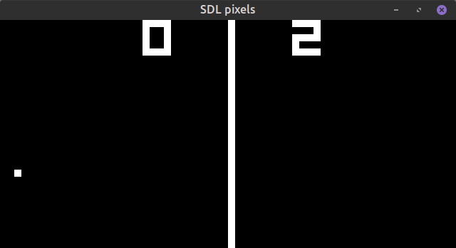
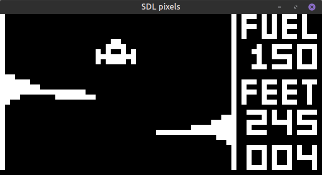

# Chip-8 emulator
This is a simple chip-8 emulator written in c++, using SDL2.
[This](https://en.wikipedia.org/wiki/CHIP-8) Wikipedia article explains the architecture of chip-8 in detail. 

## Building

Requirements

```bash
sudo apt install cmake libsdl2-dev
```

Compiling the emulator.

```bash
mkdir build
cd build
cmake --build .
```

Running the rom.

```bash
./Main <path-to-rom-file>
```

## Screenshots

### Pong


### Lunar lander

